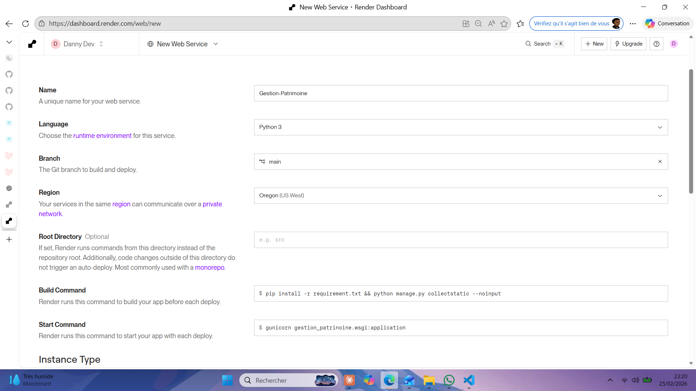
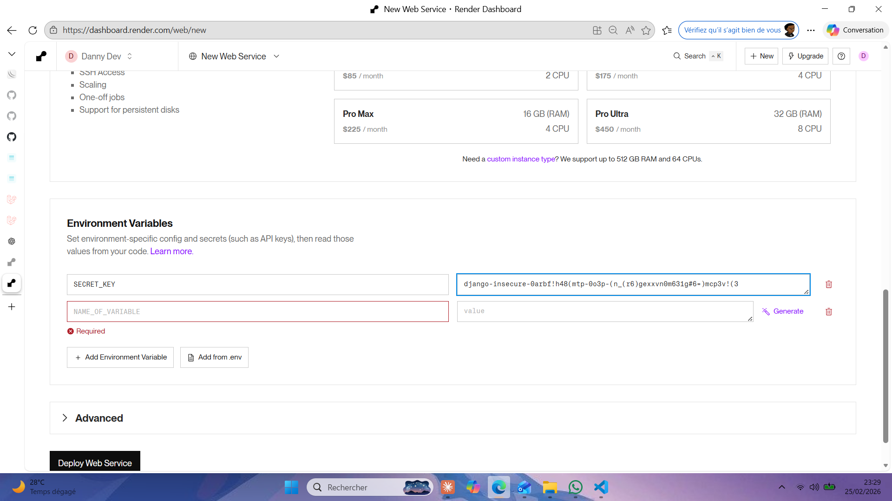
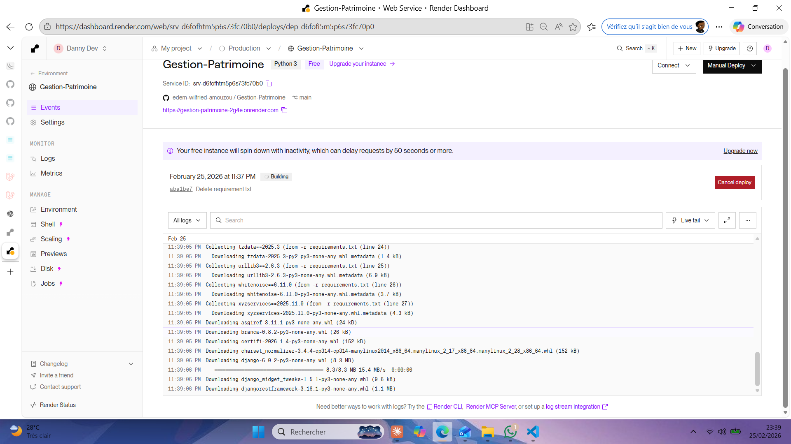

#Creation de fichier sans extension Procfile
    web: gunicorn gestion_patrinoine.wsgi --log-file -

#Créationde fichier runtime.txt 
    python-3.13.0

#Rassemblage des fichiers statics en staticfiles
    python manage.py collectstatic

#Création de compte Render 
    render.com
#Configuration de mon Render

#Ajout des variables d'env sur Render

#En déployement

#Depoyement réussi 
    Ajout de variable de host
    ALLOWED_HOSTS=gestion-patrimoine-2g4e.onrender.com

#Modification des PUBLIC_PATHS[
    "/home/",
    "/api/",
    "/sign_in/",
    "/sign_up/",
    "/admin/",
    "/reset/",
    "/auth/google/login/",
    "/auth/google/callback/",
    "/password-reset/",
    "/static/",
    "/media/",
]
    
#Ajout dans settings.py 

SECURE_PROXY_SSL_HEADER = ('HTTP_X_FORWARDED_PROTO', 'https')
USE_X_FORWARDED_HOST = True

CSRF_TRUSTED_ORIGINS = [
    "https://gestion-patrimoine-2g4e.onrender.com",
]