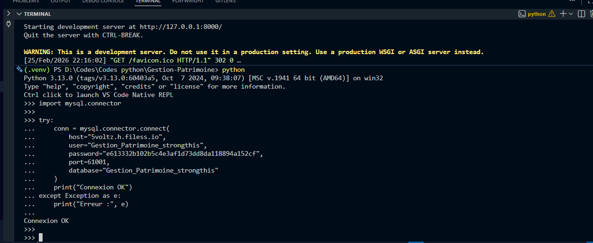

# Documentation de mise en place du projet Gestion-Patrimoine

## Fichier .env

Créer un fichier `.env` à la racine du projet (même niveau que `manage.py`) avec le contenu suivant :

```env
SECRET_KEY=votre-secret-key
DEBUG=True
GOOGLE_CLIENT_ID=votre-google-client-id
GOOGLE_CLIENT_SECRET=votre-google-client-secret
DB_NAME=nom-de-la-base
DB_USER=utilisateur
DB_PASSWORD=mot-de-passe
DB_HOST=host.filess.io
DB_PORT=61001
```

Ne jamais commiter ce fichier. Vérifier qu'il est bien dans `.gitignore`.

## Base de données MySQL

La base de données est hébergée sur filess.io (plan gratuit, MySQL).

Dans `gestion_patrinoine/settings.py`, remplacer la configuration SQLite par :

```python
DATABASES = {
    'default': {
        'ENGINE': 'mysql.connector.django',
        'NAME': config('DB_NAME'),
        'USER': config('DB_USER'),
        'PASSWORD': config('DB_PASSWORD'),
        'HOST': config('DB_HOST'),
        'PORT': config('DB_PORT', default='61001'),
    }
}
```

Le paramètre DEBUG doit être casté en booléen pour éviter une erreur avec le connecteur MySQL :

```python
DEBUG = config('DEBUG', cast=bool)
```

## Migration

Appliquer les migrations sur la base MySQL :

```powershell
python manage.py migrate
python manage.py createsuperuser
```


SuperUserName : Daniel
email : dannyakoumany@gmail.com
mot de passe : dan@123

Installation de gunicorn whitenoise  : pip install gunicorn whitenoise
pip freeze > requirements.txt


# Test de Mysql base sur filless.io
```
import mysql.connector

try:
    conn = mysql.connector.connect(
        host="5voltz.h.filess.io",
        user="Gestion_Patrimoine_strongthis",
        password="e613332b102b5c4e3af1d73dd8da118894a152cf",
        port=61001,
        database="Gestion_Patrimoine_strongthis"
    )
    print("Connexion OK")
except Exception as e:
    print("Erreur :", e)
```



